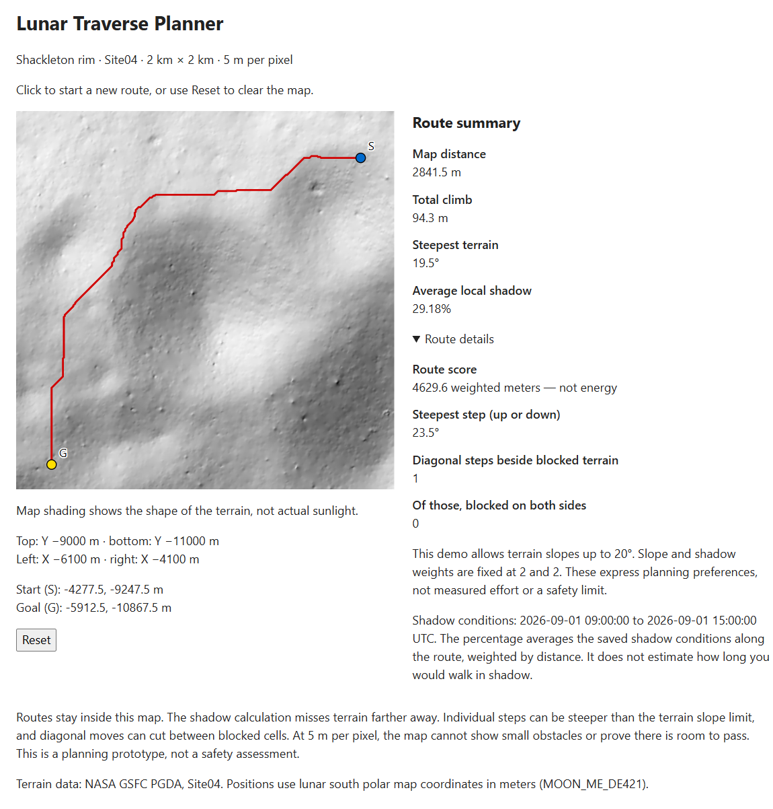
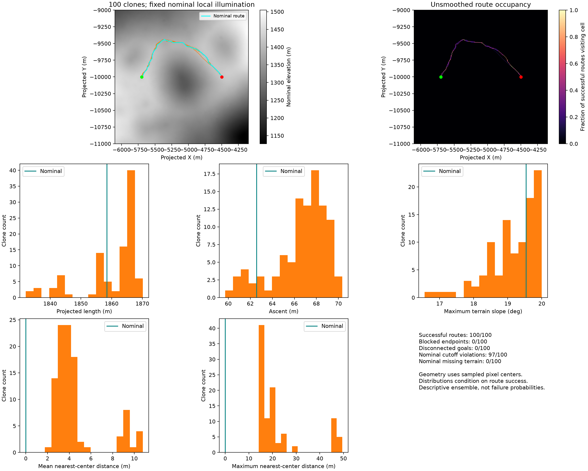

# Lunar Traverse Planner

A route planner for the lunar south pole, built with real NASA terrain data.
I built it to explore how uncertainty in terrain measurements affects route planning.



A route from two points picked in the demo: 2.84 km with 94.3 m of climbing.

## Run it

With Docker running, run this from the repository root:

```sh
docker build -t lunar-traverse-planner . && docker run --rm -p 127.0.0.1:8000:8000 lunar-traverse-planner
```

Open **http://localhost:8000** and click a start and an end point.
Click again to start a new route, or use Reset to clear the map.

The data comes with the repo. You only need Docker; it handles the build and runs
the app. Docker Desktop on WSL needs WSL integration enabled.

## What it does

The planner looks for a route that avoids steep ground and shadow. Ground above
the chosen slope limit is blocked. If the points cannot be connected, it says so.

The demo covers a 2 km square near Shackleton crater. It uses a fixed 20° slope
limit and shadow conditions for September 1, 2026, 09:00–15:00 UTC. The shadow
map is calculated ahead of time, so running the app does not repeat that work.

The route score expresses a preference for easier terrain. It does not tell you
how much energy an astronaut would use or how long the walk would take.

## What I found

### Similar routes can still fail the slope check

NASA provides 100 versions of the terrain with modeled measurement error.
I planned a route on the original map, then checked that same route on each version.

In **97 of 100**, part of the route became steeper than the 20° limit. Usually
it was just two cells out of 306.

Yet the best routes on those slightly different maps stayed close together:
the median average separation from the original was only **3.81 m**, less than
one pixel. Looking at the route shapes alone would miss the problem.



### Leaving some margin helps

I then planned a route using a stricter **15° limit**, but still checked it against
20°. That route passed in **99 of 100** terrain versions, up from 3 of 100.

It added just **29 m**, or **1.58%**, to the walk. One version still failed at a
single cell. This worked well in this experiment; it is not a guarantee of safety.

### Avoiding shadow makes the walk longer

Adding a preference for less shadow made the route about **338 m longer (22%)**.
Its average local shadow fraction fell from about **61% to 0.3%**. Those numbers
describe the saved shadow map along the route, not time an astronaut spends in shadow.

### The slope calculation closely matches NASA's map

I compared three ways of calculating slope against NASA's published slope map.
Central differences gave the closest match, with an error of about **0.00024° RMSE**,
so that is what the project uses. This checks the result; it does not establish
how NASA implemented its calculation.

## Limits

This is a planning prototype. A 5 m terrain map cannot show individual rocks or
prove that an astronaut can safely pass through a gap.

- **The route score is uncalibrated.** I did not find a usable, verified model for
  astronaut energy use in the sources I reviewed.
- **20° is a planning choice.** It is informed by published NASA planning material,
  but it is not a verified safety limit. The 15° comparison is an experiment.
- **The shadow map is local.** It misses shadows from terrain beyond the source map.
  It also averages a fixed six-hour window, rather than following the astronaut's
  arrival time at each point.
- **Slope and clearance are different.** A step along a route can be steeper than
  the map's slope value. Diagonal moves can also cut between blocked cells; the
  planner does not check whether there is enough room to pass.
- **These results cover one place and one time window.** The shadow map stays fixed
  while the terrain changes. Passing 99 of 100 versions is an experiment result,
  not a measured 99% chance of a safe walk.

## Data

The terrain comes from NASA GSFC's Planetary Geodynamics Data Archive:
[Site04 LRO/LOLA data, near Shackleton crater](https://pgda.gsfc.nasa.gov/products/78),
at 5 meters per pixel.

The bundled DEM is a lossless crop of that data. The shadow raster and illumination
report are computed outputs of this project. Sun positions come from NASA NAIF's
SPICE tools and data.

Credit: Barker et al. (2021), *Improved LOLA Elevation Maps for South Pole Landing
Sites: Error Estimates and Their Impact on Illumination Conditions*, Planetary & Space
Science 203, 105119,
[doi:10.1016/j.pss.2020.105119](https://doi.org/10.1016/j.pss.2020.105119).

## Reproduce the analysis

You only need this part to rerun the calculations. Running the Docker demo does
not require it.

Install uv and Python 3.11, then download the source terrain and Sun-position data.
The shadow calculation takes several minutes:

```sh
uv sync --locked --python 3.11
uv run python scripts/download_site04.py
uv run python scripts/download_site04.py --kernels-only
uv run python -m scripts.plan_site04 --illumination \
  --start-xy-m -5697.5 -10002.5 --goal-xy-m -4497.5 -10002.5 \
  --slope-weight 2 --shadow-weight 2 \
  --start-utc 2026-09-01T09:00:00 --end-utc 2026-09-01T15:00:00 \
  --bounds-m -6100 -11000 -4100 -9000 --time-step-seconds 300
```

Slope comparison against NASA's raster:

```sh
uv run python -m scripts.validate_site04_slope
```

Clone ensemble. The download is about 4.1 GB and the analysis runs in about 14 seconds:

```sh
uv run python scripts/download_site04.py --clones-only --workers 4
uv run python -m core.clones --site 04
```

The terrain versions are called clones. Each is a complete elevation map, even
though its filename ends in `_err.tif`. The analysis uses each one directly.
Results are saved in `data/Site04/site04_clones_report.json`.

## Develop

After preparing the source data above, start the API:

```sh
uv run uvicorn api.main:app --reload
```

With Node installed, start the frontend in another terminal:

```sh
cd web && npm ci && npm run dev
```

Run Python checks with `uv run pytest` and `uv run ruff check .`.
Run `npm run lint` and `npm run build` from `web/` for the frontend.
The full test suite needs the source terrain, clones, Sun-position data, and saved
shadow outputs. The bundle integrity test only needs the included bundle.

## Regenerate the runtime bundle

After preparing the source data, this crops the source DEM to the 402x402 analysis
window, copies the shadow raster and illumination report, writes a hash manifest,
and verifies the bundle produces identical results to the full source.

```sh
uv run python scripts/package_runtime_bundle.py
```

This replaces the four files in `data/runtime/` that ship with the app.
Their hashes detect changed files; they do not authenticate the NASA source.

For development, `LUNAR_DATA_DIR=data/runtime` makes the API use this bundle.
Without that setting it uses the full source data in `data/Site04/`.
Docker already sets this for you.
